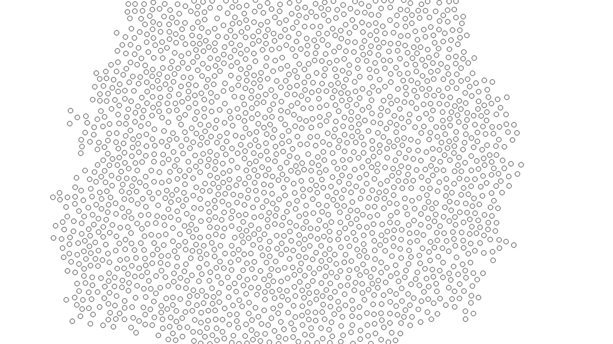
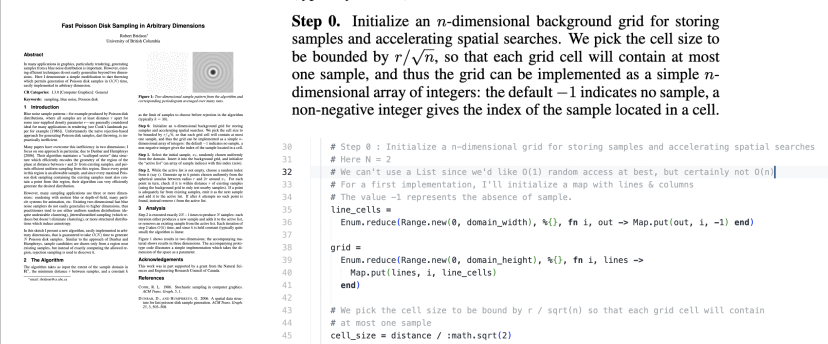
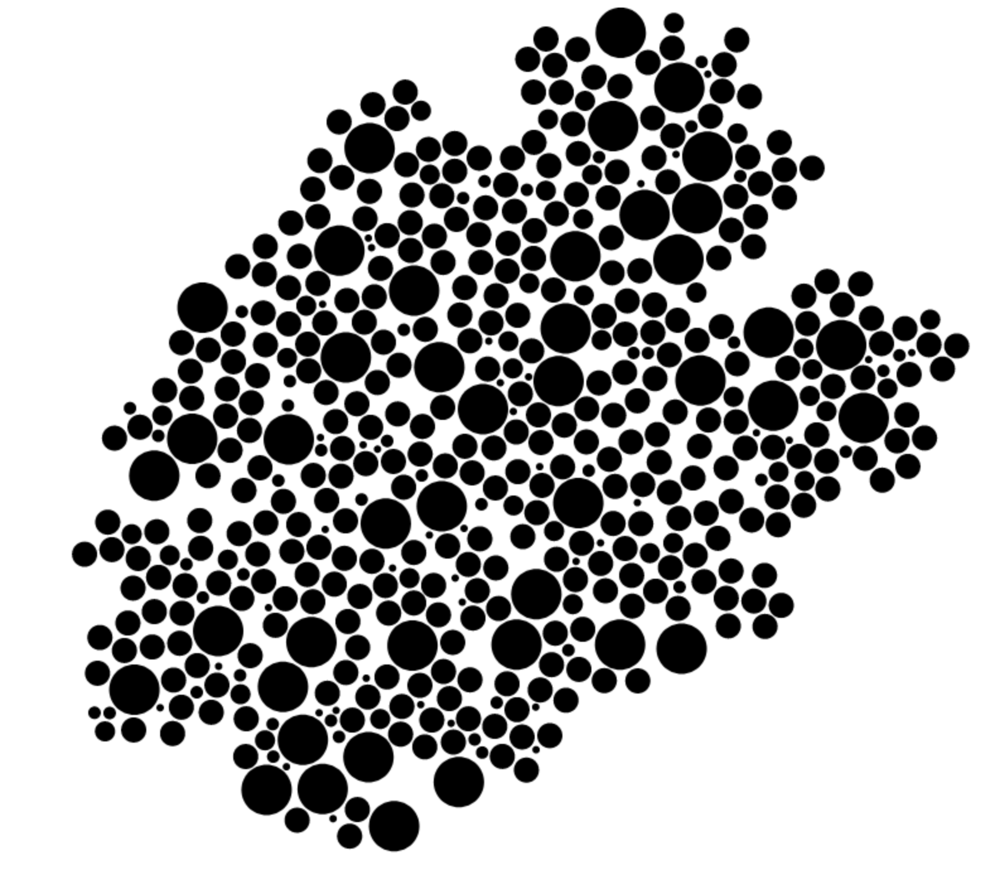

# Fastfish

Fast poisson disk sampling in 2D in Elixir (& Elixir + Rust), also multi-radius disk placement based on the same method

## Fast poisson disk sampling

### Origins of the algorithm
I stumbled on this **elegant visualisation by Jason Davies** (https://www.jasondavies.com/poisson-disc/), based on the paper **"Fast Poisson Disk Sampling in Arbitrary Dimensions" by Robert Bridson, University of British Columbia.**

I was looking for an algorithm to place items on a bounded map with an homogenous repartition with a natural feel.

The linked paper on J.Davies's website was really interesting because of its conciseness and clarity. It fits on a single page.



### Implementation - read a paper together
The code in `fastfish.ex` is **heavily commented** to read along the paper. The main difference is that I need to place a specific number of items with this repartition in an universe, so I don't fill the available space but stop when my items are placed.
**The cell size is unused at this point**, because I'm working on an adaptation of this algorithm to handle a fixed list of different-radiused disks to be placed from center.



### Usage

Don't count on a stable API since I published this mainly to show how you can follow along a concise paper and work through it, but :

```elixir
Fastfish.sample(universe_width, universe_height, distance, k_samples, items)
```


```iex
iex(1)> Fastfish.sample(200, 200, 5, 30, 0..10 |> Enum.into([]))
{:ok,
 [
   %Fastfish.Point{x: 133.22702823516536, y: 68.62183195726422, data: 5},
   %Fastfish.Point{x: 130.03055811979786, y: 74.08996948304181, data: 3},
   %Fastfish.Point{x: 121.11434113919326, y: 82.51976141062774, data: 8},
   %Fastfish.Point{x: 93.08747429977802, y: 78.97486701773849, data: 7},
   %Fastfish.Point{x: 123.58411706348512, y: 72.93372906377856, data: 9},
   %Fastfish.Point{x: 99.09686656561144, y: 79.22608607040829, data: 4},
   %Fastfish.Point{x: 124.16568387689189, y: 81.47519363081939, data: 2},
   %Fastfish.Point{x: 123.21458608552476, y: 88.83203333625944, data: 10},
   %Fastfish.Point{x: 109.35402808482807, y: 84.39153817302201, data: 6},
   %Fastfish.Point{x: 104.09928570715282, y: 97.64056451070834, data: 0},
   %Fastfish.Point{x: 97.5, y: 97.5, data: 1}
 ]}
```

### Rust NIF

A rust NIF reimplements the `sample/5` function. Here are some benchmarks.
It seems that the fixed cost of calling into Rust dominates when I need only a few elements.
The grid size seems to impact performance more than other parameters, and time seems to indeed grow linearly with the number of elements.
The value of k when K > 30 does not seem to have a lot of effet, mainly because most points are placed well under 30 attempts.
30 being the value recommended in the paper.

```
Comparison:
Rust   , 25000x25000 grid, 20000 samples, k=60         0.104
Elixir , 25000x25000 grid, 20000 samples, k=60        0.0291 - 3.57x slower +24.73 s

Comparison:
Rust   , 5000x5000 grid, 20000 samples, k=60          1.81
Elixir , 5000x5000 grid, 20000 samples, k=60        0.0292 - 62.00x slower +33.68 s
```

### Roadmap

- [ ] Compare the naïve implementation backed by a map to other data structures
- [x] Rust FFI via Rustler to build coordinates faster

## Multi-radius disk placement

Sometimes you have to place contiguous items of a fixed number and fixed sizes. This second implementation allows that, but loses a bit of performance provided by the background grid used in the original paper. Well, I have to do that.



```
Benchmarking Elixir, 2000 samples, k=30 ...
Benchmarking Rust  , 2000 samples, k=30 ...

Name                                 ips        average  deviation         median         99th %
Rust  , 2000 samples, k=30        374.24        2.67 ms    ±12.51%        2.63 ms        3.65 ms
Elixir, 2000 samples, k=30          3.40      294.35 ms     ±3.71%      290.54 ms      333.93 ms

Comparison:
Rust  , 2000 samples, k=30        374.24
Elixir, 2000 samples, k=30          3.40 - 110.16x slower +291.68 ms
```