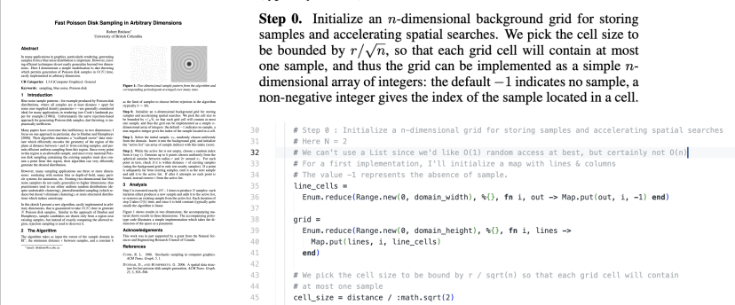

# Fastfish

Fast poisson disk sampling in 2D in Elixir

## Origins of the algorithm
I stumbled on this **elegant visualisation by Jason Davies** (https://www.jasondavies.com/poisson-disc/), based on the paper **"Fast Poisson Disk Sampling in Arbitrary Dimensions" by Robert Bridson, University of British Columbia.**

I was looking for an algorithm to place items on a bounded map with an homogenous repartition with a natural feel.

The linked paper on J.Davies's website was really interesting because of its conciseness and clarity. It fits on a single page.

## Implementation - read a paper together

The code in `fastfish.ex` is **heavily commented** to read along the paper. The main difference is that I need to place a specific number of items with this repartition in an universe, so I don't fill the available space but stop when my items are placed.



## Usage

Don't count on a stable API since I published this mainly to show how you can follow along a concise paper and work through it, but :

```elixir
Fastfish.sample(universe_width, universe_height, distance, k_samples, items)
```


```iex
iex(1)> Fastfish.sample(200, 200, 5, 30, 0..10 |> Enum.into([]))
{:ok,
 [
   %Fastfish.Point{x: 133.22702823516536, y: 68.62183195726422, data: 5},
   %Fastfish.Point{x: 130.03055811979786, y: 74.08996948304181, data: 3},
   %Fastfish.Point{x: 121.11434113919326, y: 82.51976141062774, data: 8},
   %Fastfish.Point{x: 93.08747429977802, y: 78.97486701773849, data: 7},
   %Fastfish.Point{x: 123.58411706348512, y: 72.93372906377856, data: 9},
   %Fastfish.Point{x: 99.09686656561144, y: 79.22608607040829, data: 4},
   %Fastfish.Point{x: 124.16568387689189, y: 81.47519363081939, data: 2},
   %Fastfish.Point{x: 123.21458608552476, y: 88.83203333625944, data: 10},
   %Fastfish.Point{x: 109.35402808482807, y: 84.39153817302201, data: 6},
   %Fastfish.Point{x: 104.09928570715282, y: 97.64056451070834, data: 0},
   %Fastfish.Point{x: 97.5, y: 97.5, data: 1}
 ]}
```

## Roadmap

- [ ] Compare the naïve implementation backed by a map to other data structures
- [ ] Rust FFI via Rustler to build coordinates faster